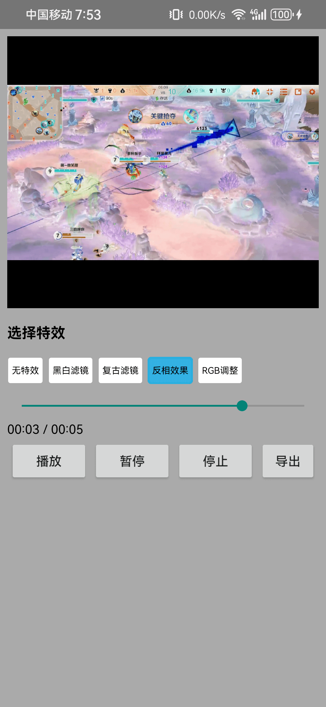
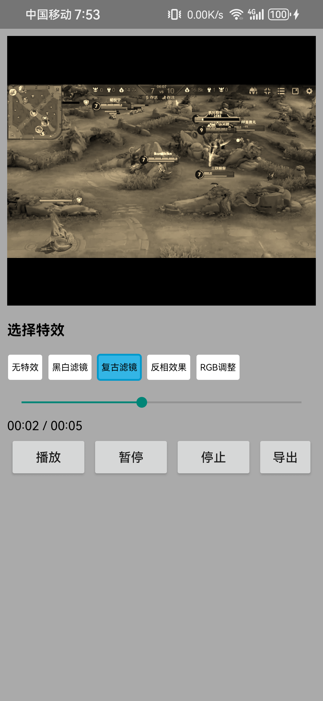
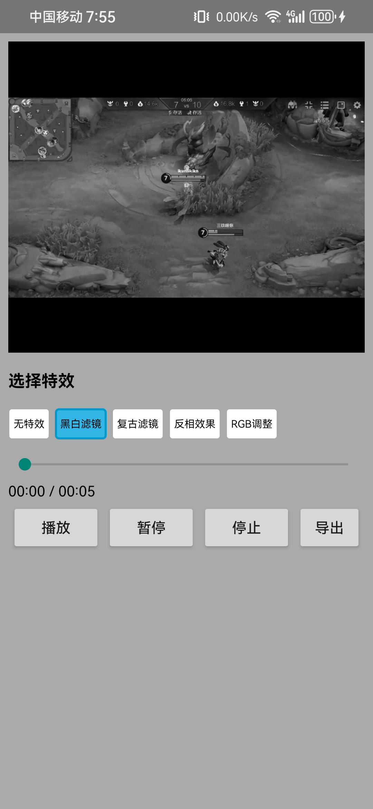
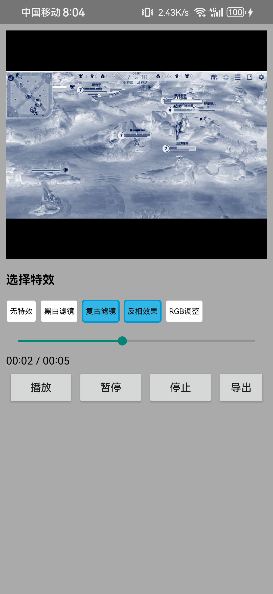

# Android 视频播放器项目 (VMPlayer)

## 效果演示

下面是在预览与导出流程中的效果示例（图片位于项目根目录下的 `.img` 文件夹）：

| 复古特效效果                  | 反相特效效果                   | 黑白滤镜效果                    | 多特效组合效果 |
|-------------------------|--------------------------|---------------------------| --- |
|  |  |  |  |

## 项目简介

这是一个基于 Android 平台开发的**实验性**
视频播放器项目，是对视频播放器渲染技术深入探索的成果。项目支持多视频片段播放、实时预览、视频导出等功能，采用模块化架构设计，包含自定义的媒体处理框架和播放器实现。

> **注意**: 这是一个个人学习和技术探索项目，主要用于研究视频渲染、OpenGL ES、音视频同步、MediaCodec编解码等技术。代码仅供学习参考，不建议直接用于生产环境。

## 技术探索重点

本项目重点探索和实践了以下技术领域：

- 🎬 **自定义视频渲染管线**: 基于 OpenGL ES 构建完整渲染流程
- 🎵 **音视频同步机制**: 精确的时间轴管理和音视频同步算法
- ⚡ **多线程架构**: 解码、渲染、音频播放的线程协调（Handler + Thread）
- 🔄 **内存管理优化**: 纹理缓存、解码器资源管理
- 📤 **视频导出技术**: MediaCodec 编解码和 MediaMuxer 文件输出
- 🎯 **片段化播放**: 支持多视频片段的无缝拼接播放
- 🔧 **解耦架构设计**: 播放器、解码器、编码器、渲染器的模块化设计
- 🎨 **渲染效果 / 会话系统**: 基于 `VMRenderSession` 的统一特效配置，预览与导出共用一套渲染链

## 功能特性

### 核心功能

- ✅ **多视频片段播放**: 支持播放多个视频片段组成的播放列表（TrackSegment）
- ✅ **实时视频预览**: 基于 OpenGL ES 的视频渲染（Surface渲染）
- ✅ **视频导出**: 支持将播放列表导出为单个 MP4 文件
- ✅ **播放控制**: 播放、暂停、停止、Seek、进度控制
- ✅ **时间轴管理**: 精确的时间轴管理和片段切换
- ✅ **音视频同步**: 基于 AudioTrack 的音视频同步播放
- ✅ **格式支持**: 支持常见视频格式（MP4、H.264、AAC等）
- ✅ **渲染效果**: 支持反转、RGB调整等视频特效
- ✅ **视口适配**: 智能视口适配和等比例缩放

### 导出功能特性

- 🎥 **视频编码**: H.264/AVC 视频编码
- 🎵 **音频编码**: AAC 音频编码
- 📊 **实时进度**: 导出进度回调
- ⚙️ **可配置参数**: 分辨率、码率、帧率可自定义
- 🔄 **多线程处理**: 音视频独立线程处理，提高导出效率

## 核心架构设计

### 1. 播放器架构

```
VMPlayer (播放器入口)
    ↓
PlayerThread (视频线程) + PlayerThreadAudio (音频线程)
    ↓
VideoDecoderTrack + AudioDecoderTrack (轨道管理)
    ↓
VideoDecoder + AudioDecoder (MediaCodec 解码)
    ↓
PlayerRenderer (OpenGL ES 渲染) + AudioTrack (音频播放)
    ↓
AVSyncManager (音视频同步)
```

### 2. 渲染效果与渲染会话系统

```
VMRenderSession (渲染会话，对外的特效配置入口)
    ↓
EffectChainManager (特效链管理与同步)
    ↓
EffectGroup (特效组合，负责将特效串联起来)
    ↓
BaseEffect (基础特效)
    ↓
├── InvertEffect (反转特效)
├── RGBEffect (RGB调整特效)
└── 其他自定义特效...
    ↓
RenderEffect / TextureMatrixEffect 等内部特效
    ↓
PlayerRender (具体渲染器，预览/导出共用)
```

### 3. 视口适配系统

```
GLUtils.initGLViewportFit()
    ↓
计算等比例缩放视口
    ↓
返回VRect对象 (origin + size)
    ↓
PlayerRender.beforeDraw() 应用视口适配
```

### 4. 导出架构

```
Exporter (导出管理器)
    ↓
├── VideoReader Thread              ├── AudioReader Thread
│   ↓ 解码                          │   ↓ 解码
│   VideoReader                     │   AudioReader
│   ↓ Surface                       │   ↓ PCM数据
│   VideoEncoder                    │   AudioEncoder
│   ↓ H.264编码                     │   ↓ AAC编码
│   └─────────┬─────────────────────┘
│             ↓
│        MediaMuxer (合成MP4)
│             ↓
│        输出文件 (output.mp4)
```

### 5. 线程模型

- **主线程**: UI交互和生命周期管理
- **视频解码线程** (HandlerThread): 视频解码和渲染
- **音频解码线程** (HandlerThread): 音频解码和播放
- **GLThread**: OpenGL ES 渲染线程
- **导出视频线程**: 视频读取和编码
- **导出音频线程**: 音频读取和编码

## 技术栈

- **语言**: Kotlin + Java
- **最低SDK**: API 21 (Android 5.0)
- **核心技术**:
    - MediaCodec (视频编解码)
    - MediaExtractor (媒体数据提取)
    - MediaMuxer (媒体文件合成)
    - OpenGL ES 2.0 (视频渲染)
    - AudioTrack (音频播放)
    - HandlerThread (线程管理)
    - Coroutines (协程-用于导出流程)

## 最新更新

- ✅ **新增VRect模型**: 用于表示渲染矩形区域，支持视口适配
- ✅ **视口适配功能**: 智能计算等比例缩放的视口配置
- ✅ **渲染效果系统**: 支持多种视频特效和滤镜处理
- ✅ **模块化架构优化**: 更好的代码组织和可扩展性

## 开发计划

- 🔄 **性能优化**: 渲染管线优化和内存管理改进
- 🔄 **更多特效**: 添加模糊、锐化、色彩调整等特效
- 🔄 **贴纸系统**: 支持动态贴纸和文字叠加
- 🔄 **硬件加速**: 进一步优化MediaCodec使用效率