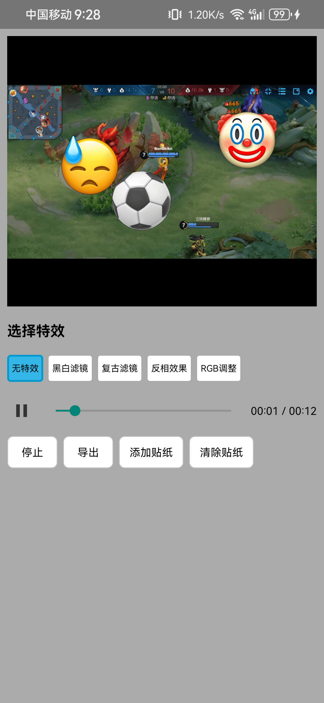
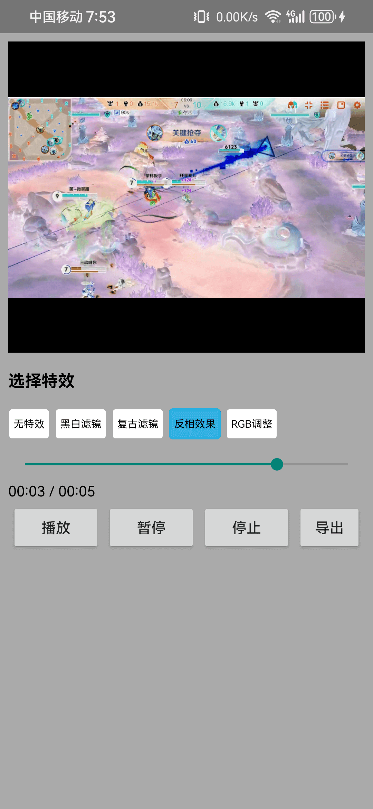
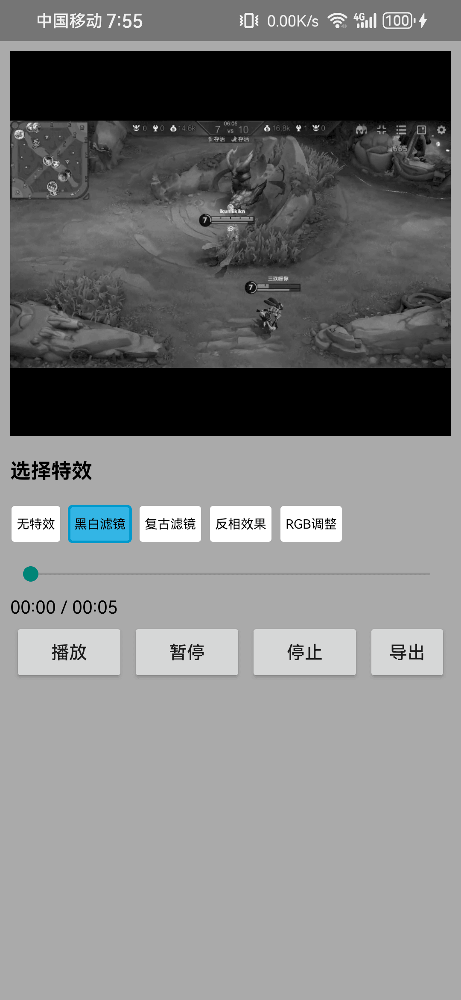
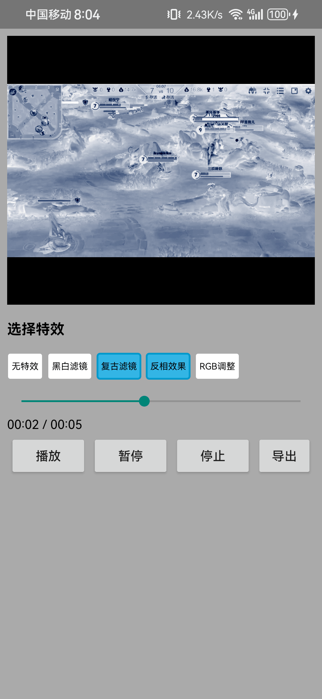

# Android 视频播放器项目 (VMPlayer)

## 效果演示

下面是在预览与导出流程中的效果示例（图片位于项目根目录下的 `.img` 文件夹）：

| 贴纸特效                      | 反相特效效果                   | 黑白滤镜效果                    | 多特效组合效果 |
|---------------------------|--------------------------|---------------------------| --- |
|  |  |  |  |

## 项目简介

这是一个基于 Android 平台开发的**实验性**
视频播放器项目，是对视频播放器渲染技术深入探索的成果。项目支持多视频片段播放、实时预览、视频导出等功能，采用模块化架构设计，包含自定义的媒体处理框架和播放器实现。

> **注意**: 这是一个个人学习和技术探索项目，主要用于研究视频渲染、OpenGL ES、音视频同步、MediaCodec编解码等技术。代码仅供学习参考，不建议直接用于生产环境。

## 项目结构

```
VMPlayer/
├── app/                    # Demo 应用模块
│   ├── src/main/assets/media/sticker/  # 贴纸资源文件夹
│   └── src/main/java/.../vmplayer/     # Demo 入口与 UI
├── vmplayer/               # 核心播放器库模块（可独立发布）
│   └── src/main/java/com/vompom/media/
│       ├── render/         # 渲染系统（OpenGL ES）
│       │   ├── effect/     # 滤镜特效（反转、灰度、复古等）
│       │   └── sticker/    # 贴纸系统
│       ├── export/         # 视频导出（编码器、读取器、Muxer）
│       ├── docode/         # 视频解码（解码器、轨道管理）
│       ├── player/         # 播放器核心（线程、同步、回调）
│       ├── model/          # 数据模型
│       └── utils/          # 工具类
└── docs/                   # 技术文档
```

## 技术探索重点

本项目重点探索和实践了以下技术领域：

-  **自定义视频渲染管线**: 基于 OpenGL ES 构建完整渲染流程
-  **音视频同步机制**: 精确的时间轴管理和音视频同步算法
-  **多线程架构**: 解码、渲染、音频播放的线程协调（Handler + Thread）
-  **内存管理优化**: 纹理缓存、解码器资源管理
-  **视频导出技术**: MediaCodec 编解码和 MediaMuxer 文件输出
-  **片段化播放**: 支持多视频片段的无缝拼接播放
-  **解耦架构设计**: 播放器、解码器、编码器、渲染器的模块化设计
-  **渲染效果/会话系统**: 基于 `VMRenderSession` 的统一特效配置，预览与导出共用一套渲染链
-  **贴纸系统**: 基于 OpenGL ES 的实时贴纸叠加，支持自定义位置、大小、透明度

## 功能特性

### 核心功能

- ✅ **多视频片段播放**: 支持播放多个视频片段组成的播放列表（TrackSegment）
- ✅ **实时视频预览**: 基于 OpenGL ES 的视频渲染（Surface渲染）
- ✅ **视频导出**: 支持将播放列表导出为单个 MP4 文件
- ✅ **播放控制**: 播放、暂停、停止、Seek、进度控制
- ✅ **时间轴管理**: 精确的时间轴管理和片段切换
- ✅ **音视频同步**: 基于 AudioTrack 的音视频同步播放
- ✅ **格式支持**: 支持常见视频格式（MP4、H.264、AAC等）
- ✅ **视口适配**: 智能视口适配和等比例缩放

### 渲染特效

- ✅ **反转特效** (InvertEffect): 颜色反转
- ✅ **灰度特效** (GrayscaleEffect): 黑白滤镜
- ✅ **复古特效** (SepiaEffect): 怀旧色调
- ✅ **RGB调整** (RGBEffect): 自定义 RGB 通道调整
- ✅ **特效组合**: 支持多个特效叠加使用

### 贴纸系统

- ✅ **实时贴纸叠加**: 基于 OpenGL ES 的贴纸渲染
- ✅ **自定义参数**: 支持设置位置（posX/posY）、大小（width/height）、透明度（alpha）
- ✅ **保持原始比例**: 贴纸自动保持原始宽高比
- ✅ **随机贴纸**: Demo 支持从贴纸文件夹中随机选择贴纸添加
- ✅ **导出支持**: 贴纸效果在视频导出时完整保留

### 导出功能特性

- 🎥 **视频编码**: H.264/AVC 视频编码
- 🎵 **音频编码**: AAC 音频编码
- 📊 **实时进度**: 导出进度回调
- ⚙️ **可配置参数**: 分辨率、码率、帧率可自定义
- 🔄 **多线程处理**: 音视频独立线程处理，提高导出效率
- 🖼️ **特效与贴纸导出**: 预览中的滤镜特效和贴纸在导出时完整保留

## 核心架构设计

### 1. 播放器架构

```
VMPlayer (播放器入口)
    ↓
PlayerThread (视频线程) + PlayerThreadAudio (音频线程)
    ↓
VideoDecoderTrack + AudioDecoderTrack (轨道管理)
    ↓
VideoDecoder + AudioDecoder (MediaCodec 解码)
    ↓
PlayerRenderer (OpenGL ES 渲染) + AudioTrack (音频播放)
    ↓
AVSyncManager (音视频同步)
```

### 2. 渲染效果与贴纸系统

```
VMRenderSession (渲染会话，对外的特效配置入口)
    ↓
EffectChainManager (特效链管理与同步)
    ↓
EffectGroup (特效组合，管理滤镜 + 贴纸)
    ↓
├── filterQueue (滤镜队列)
│   ├── InvertEffect (反转特效)
│   ├── GrayscaleEffect (灰度特效)
│   ├── SepiaEffect (复古特效)
│   ├── RGBEffect (RGB调整特效)
│   └── 其他自定义特效...
│
├── stickerQueue (贴纸队列)
│   └── StickerEffect (贴纸特效，支持位置/大小/透明度)
│
├── RenderEffect / TextureMatrixEffect 等内部特效
│
└── PlayerRender (具体渲染器，预览/导出共用)
```

### 3. 视口适配系统

```
GLUtils.initGLViewportFit()
    ↓
计算等比例缩放视口
    ↓
返回VRect对象 (origin + size)
    ↓
PlayerRender.beforeDraw() 应用视口适配
```

### 4. 导出架构

```
Exporter (导出管理器)
    ↓
├── RenderModel (渲染数据: effectList + stickerList)
│   ↓
│   EffectGroup.createEffectGroup(effects, stickers)
│   ↓ 重建渲染链（含贴纸克隆）
│
├── VideoReader Thread              ├── AudioReader Thread
│   ↓ 解码                          │   ↓ 解码
│   VideoReader                     │   AudioReader
│   ↓ Surface                       │   ↓ PCM数据
│   VideoEncoder                    │   AudioEncoder
│   ↓ H.264编码                     │   ↓ AAC编码
│   └─────────┬─────────────────────┘
│             ↓
│        MediaMuxer (合成MP4)
│             ↓
│        输出文件 (output.mp4)
```

### 5. 线程模型

- **主线程**: UI交互和生命周期管理
- **视频解码线程** (HandlerThread): 视频解码和渲染
- **音频解码线程** (HandlerThread): 音频解码和播放
- **GLThread**: OpenGL ES 渲染线程
- **导出视频线程**: 视频读取和编码
- **导出音频线程**: 音频读取和编码

## 技术栈

- **语言**: Kotlin + Java
- **最低SDK**: API 21 (Android 5.0)
- **核心技术**:
    - MediaCodec (视频编解码)
    - MediaExtractor (媒体数据提取)
    - MediaMuxer (媒体文件合成)
    - OpenGL ES 2.0 (视频渲染)
    - AudioTrack (音频播放)
    - HandlerThread (线程管理)
    - Coroutines (协程-用于导出流程)

## 最新更新

- ✅ **贴纸系统**: 支持实时贴纸叠加，可自定义位置、大小、透明度，保持原始宽高比
- ✅ **贴纸导出支持**: 修复导出链路中贴纸数据丢失问题，导出 MP4 完整保留贴纸效果
- ✅ **Demo 贴纸体验**: 支持从贴纸文件夹随机选择贴纸添加
- ✅ **模块重命名**: 核心库模块从 `media` 重命名为 `vmplayer`
- ✅ **GitHub Packages 发布**: 新增 Gradle 发布脚本，支持将库发布到 GitHub Packages
- ✅ **UI 优化**: 功能按钮改为 RecyclerView 实现，播放/暂停按钮集成到进度条两侧
- ✅ **渲染效果系统**: 支持多种视频特效（反转、灰度、复古、RGB调整）和滤镜处理
- ✅ **视口适配功能**: 智能计算等比例缩放的视口配置

## 开发计划

- 🔄 **性能优化**: 渲染管线优化和内存管理改进
- 🔄 **更多特效**: 添加模糊、锐化、色彩调整等特效
- 🔄 **贴纸交互**: 支持手势拖拽、缩放、旋转贴纸
- 🔄 **文字叠加**: 支持动态文字水印
- 🔄 **硬件加速**: 进一步优化MediaCodec使用效率