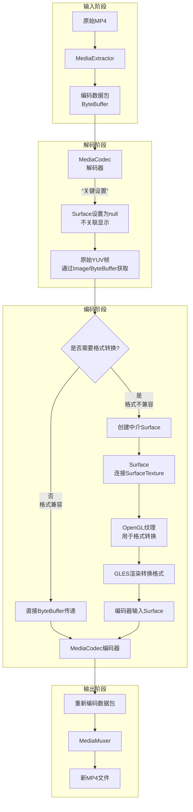
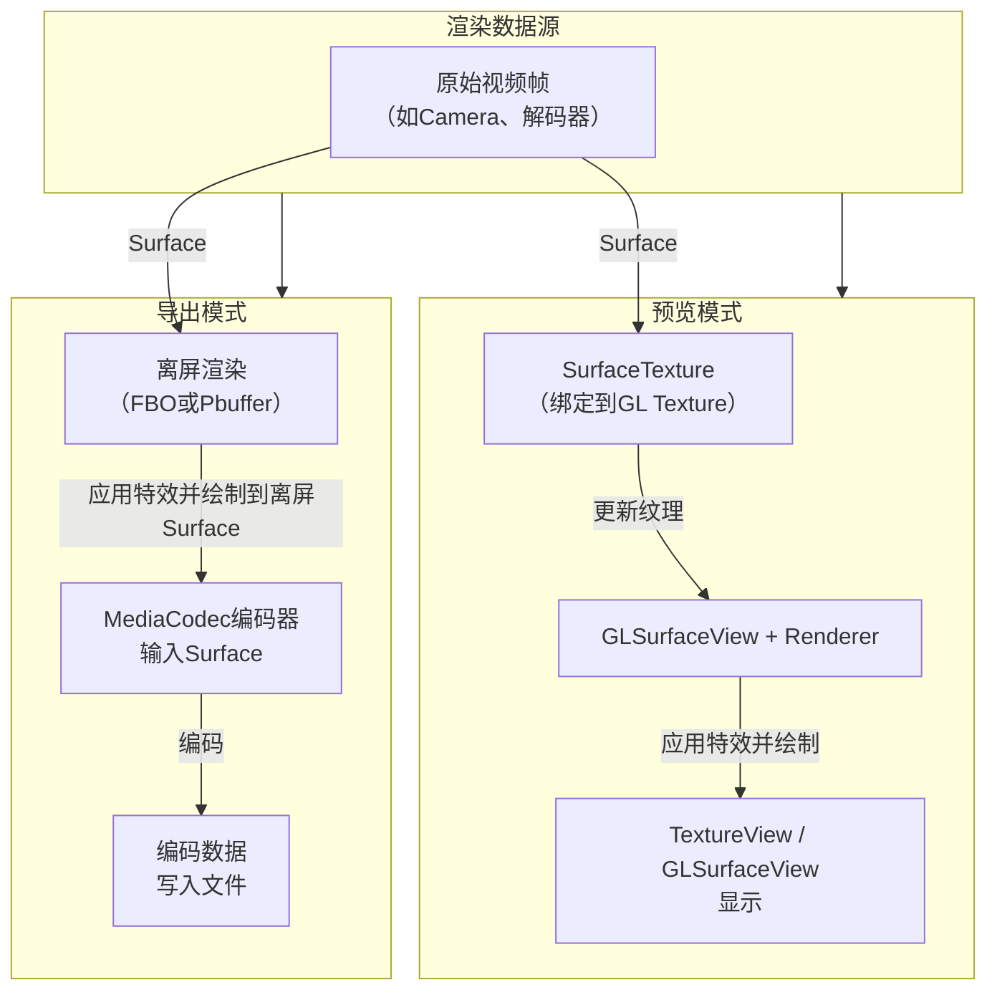
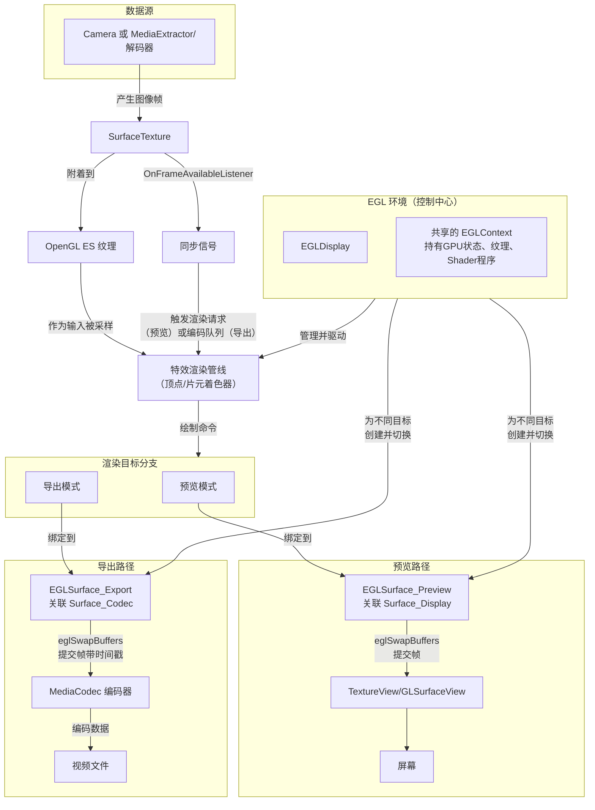

```mermaid
flowchart TD
    subgraph Input [输入阶段]
        A[原始MP4] --> B[MediaExtractor]
        B --> C[编码数据包<br>ByteBuffer]
    end

    subgraph Decode [解码阶段]
        C --> D[MediaCodec<br>解码器]
        D -- “关键设置” --> E[Surface设置为null<br>不关联显示]
        E --> F[原始YUV帧<br>通过Image/ByteBuffer获取]
    end

    subgraph Encode [编码阶段]
        F --> G{是否需要格式转换?}
        
        G -- 否<br>格式兼容 --> H[直接ByteBuffer传递]
        H --> I[MediaCodec编码器]
        
        G -- 是<br>格式不兼容 --> J[创建中介Surface]
        J --> K[Surface<br>连接SurfaceTexture]
        K --> L[OpenGL纹理<br>用于格式转换]
        L --> M[GLES渲染转换格式]
        M --> N[编码器输入Surface]
        N --> I
    end

    subgraph Output [输出阶段]
        I --> O[重新编码数据包]
        O --> P[MediaMuxer]
        P --> Q[新MP4文件]
    end
```

预览（Preview） 和导出（Export） 两个模式使用的渲染架构和数据流

```mermaid
flowchart TD
subgraph R [渲染数据源]
direction LR
R1[原始视频帧<br>（如Camera、解码器）]
end

    subgraph P [预览模式]
        direction TB
        P1[GLSurfaceView + Renderer]
        P2[SurfaceTexture<br>（绑定到GL Texture）]
        P3[TextureView / GLSurfaceView<br>显示]
        
        R1 -- Surface --> P2
        P2 -- 更新纹理 --> P1
        P1 -- 应用特效并绘制 --> P3
    end

    subgraph E [导出模式]
        direction TB
        E1[离屏渲染<br>（FBO或Pbuffer）]
        E2[MediaCodec编码器<br>输入Surface]
        E3[编码数据<br>写入文件]
        
        R1 -- Surface --> E1
        E1 -- 应用特效并绘制到离屏Surface --> E2
        E2 -- 编码 --> E3
    end

    R --> P & E
```

预览和导出两种模式下，EGL如何通过不同的EGLSurface来管理数据流

```mermaid
flowchart TD
subgraph SRC [数据源]
A[Camera 或 MediaExtractor/解码器]
end

    subgraph EGL_Env [EGL 环境（控制中心）]
        direction TB
        E1[EGLDisplay]
        E2[共享的 EGLContext<br>持有GPU状态、纹理、Shader程序]
    end

    A -- 产生图像帧 --> ST[SurfaceTexture]

    ST -- 附着到 --> GLTex[OpenGL ES 纹理]
    
    GLTex -- 作为输入被采样 --> Render[特效渲染管线<br>（顶点/片元着色器）]

    subgraph Mode [渲染目标分支]
        direction TB
        P[预览模式]
        E[导出模式]
    end

    Render -- 绘制命令 --> Mode

    subgraph P_Target [预览路径]
        P_Surf[EGLSurface_Preview<br>关联 Surface_Display]
        P_View[TextureView/GLSurfaceView]
        P_Screen[屏幕]
    end

    subgraph E_Target [导出路径]
        E_Surf[EGLSurface_Export<br>关联 Surface_Codec]
        E_Codec[MediaCodec 编码器]
        E_File[视频文件]
    end

    P -- 绑定到 --> P_Surf
    P_Surf -- eglSwapBuffers<br>提交帧 --> P_View --> P_Screen

    E -- 绑定到 --> E_Surf
    E_Surf -- eglSwapBuffers<br>提交帧带时间戳 --> E_Codec -- 编码数据 --> E_File

    %% 核心控制流
    EGL_Env -- 管理并驱动 --> Render
    EGL_Env -- 为不同目标<br>创建并切换 --> P_Surf & E_Surf

    %% 帧可用监听
    ST -- OnFrameAvailableListener --> Sync[同步信号]
    Sync -- 触发渲染请求<br>（预览）或编码队列（导出） --> Render
```